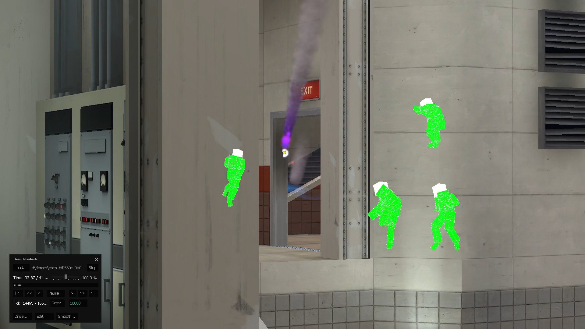

<header>
a <a href="{{ site.url }}">home</a> for <a href="{{ site.github.url }}">stuff</a>  
</header>

VAC-Safe Wallhacks, or an `sv_pure` and .vmt `$ignorez` bypass  
{{ page.date }}

## Why is this public?
I've reached out via email to two Valve employees known to actively contribute to TF2, and the TF Team, but haven't heard back since my initial email on April 20, 2025 (85 days before making this public). I disclosed in my email to the TF Team when I would make this exploit public, to raise awareness and hopefully prioritize creating a fix, and / or make it easier to come up with a community fix in the meantime.

## An overview
[`sv_pure 2`](https://developer.valvesoftware.com/wiki/Pure_Servers) doesn't allow stuff like custom sounds, models, materials, particles, etc. Some files can be "preloaded", but this tends not to be an issue with assets that would break competitive integrity.

In `/tf/gameinfo.txt`, replacing `type multiplayer_only` with `type singleplayer_only` appears to bypass this, or at least a lot of it. Player model .vmt and .vtf files are no exception. All servers are affected, no matter the `sv_pure` value.

Additionally, the .vmt `$ignorez` shader parameter is [disabled for models only](https://developer.valvesoftware.com/wiki/$ignorez), and prints a console error message saying it was ignored. `type singleplayer_only` bypasses this safeguard as well (and the console message), enabling VAC-Safe wallhacks, playermodel included. Here's a video example from a sample [demos.tf](https://demos.tf/) demo:

<video controls width="640" height="360">
  <source src="../assets/media/wallhacks-demo.mp4" type="video/mp4">
</video>

This may also be present in other Source games (aside from CS:GO (see below) and CS2), though I've only tested TF2. CS2 is already `singleplayer_only` within [`gameinfo.gi`](https://developer.valvesoftware.com/wiki/Gameinfo.gi) by default, likely because the option makes no difference(?) there, or only has one mode.

## Discovery
I'm not the first by any means to discover this exploit, at least for everything not involving `$ignorez`. The earliest mention I could find is from [a more thorough explanation in CS:GO](https://github.com/kkthxbye-code/csgo_bugs/blob/master/sv_pure_bypass_6/README.md) dating back to 2020, which looks to be really similar (if not the same). It was also reportedly [patched by Valve](https://blog.counter-strike.net/2020/09/31532/) not long after. cueki notes the bypass [has been widely known since 2018-2019](https://github.com/sv-pure-stuff/casual-pre-loader?tab=readme-ov-file#how-does-this-work). I'd recommend taking her words with a grain of salt, given her history of using [wallhacks to disrupt competitive PUGs](https://www.teamfortress.tv/63649/omg-3).

That aside, I came across the first example of this exploit after seeing someone use fullbright playermodels to aid with player visibility in late 2024. This has been distributed a fair bit, at least among [RGL](https://rgl.gg) 6s players. I acquired the custom files for them, and experimented until I found the `$ignorez` parameter and tested it in a private `sv_pure 2` server with a friend. In April, I compiled what I knew and a video of how to reproduce it, and reached out to Valve.

## Reproducing
This example enables wallhacks on the default RED Scout playermodel, on a fresh install of TF2. I've provided the VPK these steps produce, along with a video.
- open `/tf/gameinfo.txt` and replace `type multiplayer_only` with `type singleplayer_only`, and save.
- using VPKEdit, open `/tf/tf_misc_dir.vpk`
- navigate to `/materials/models/player/scout`, and right click -> `Extract Folder...`
- save the extracted folder to `/tf/custom/test-materials/`, after creating this filepath.
- using your favorite file explorer, navigate to `/tf/custom/test-materials/materials/models/player/scout`
- using a text editor, add `"$ignorez" "1"` to `scout_red.vmt` and `scout_head_red.vmt`, and save.
> Launch TF2.
- in console, set `sv_pure 0` and `map cp_sunshine` (to "preload" the these .vmts)
- load into the map and join any team & class
- in console, set `sv_pure 2` and `map cp_snakewater_final1`
- join BLU team on any class.
- in console, set `mp_tournament 1` and `tf_bot_add red scout`
- navigate towards RED spawn, on the last control point.
> Upon approaching spawn doors, you should be able to view the red scout's model through the wall.
> 
> 

[https://www.youtube.com/watch?v=hd4N-xtSuCo](https://www.youtube.com/watch?v=hd4N-xtSuCo)  
[test-materials.vpk](https://files.catbox.moe/edlvrv.vpk) (catbox renames files)

## Removal
Set `/tf/gameinfo.txt` back to `type multiplayer_only`, or verify game files (which will do the same thing).

## Possible fixes for server owners
VPKEdit can pack extra stuff into a map file the client is forced to load. The downside is that map filesizes would increase.. a lot (~9GB with [these default assets](https://gist.github.com/spiritov/d632e31de8c3aab84f99dfd22f98a5bc)). This doesn't include per-map assets, which should also be packed into the map. Not ideal..

In console, the output from running `trackerlistallfiles` can differentiate between TF2 launched with `singleplayer_only` from `multiplayer_only`, but is just a client-side command. The `singleplayer_only` file list has much fewer entries (depending on how much is in your custom folder), while the `multiplayer_only` list has thousands. It also appears in the console of POV demos. This would probably call for more aggressive demo checking by competitive leagues.. and of course can't stop people from joining the server and using it. It's still worth consideration. Thank you to [@rtldg](https://github.com/rtldg/) 🕵️ for discovering this.

## Possible fixes for Valve
The root cause for this is most likely in the closed-source Source Engine, not the SDK. That said, another possible fix is for Valve to add a .sig file for `gameinfo.txt`, which was done for `items_game.txt` [in 2014](https://www.teamfortress.com/post.php?id=14678). With that update, an engine error became presented if a bad `items_game.txt` was found.

## Timeline
- October 1, 2024 - discovered how the exploit could be used for wallhacks  
- April 20, 2025 - exploit report emailed to Valve employee  
- May 19, 2025 - exploit report emailed to separate Valve employee  
- June 3, 2025 - exploit report emailed to TF Team  
- July 14, 2025 - exploit released publicly

## Misc. Resources
- [VPKEdit](https://github.com/craftablescience/VPKEdit)
- [similar exploit patched in CS:GO](https://github.com/kkthxbye-code/csgo_bugs/blob/master/sv_pure_bypass_6/README.md)
- [TF2 update that verified items_game.txt](https://www.teamfortress.com/post.php?id=14678)
- [permanent forks of cueki's sv_pure bypasser and bsp patcher](https://github.com/orgs/sv-pure-stuff/repositories)
  - VPKEdit should be preferred to patch map .bsps
